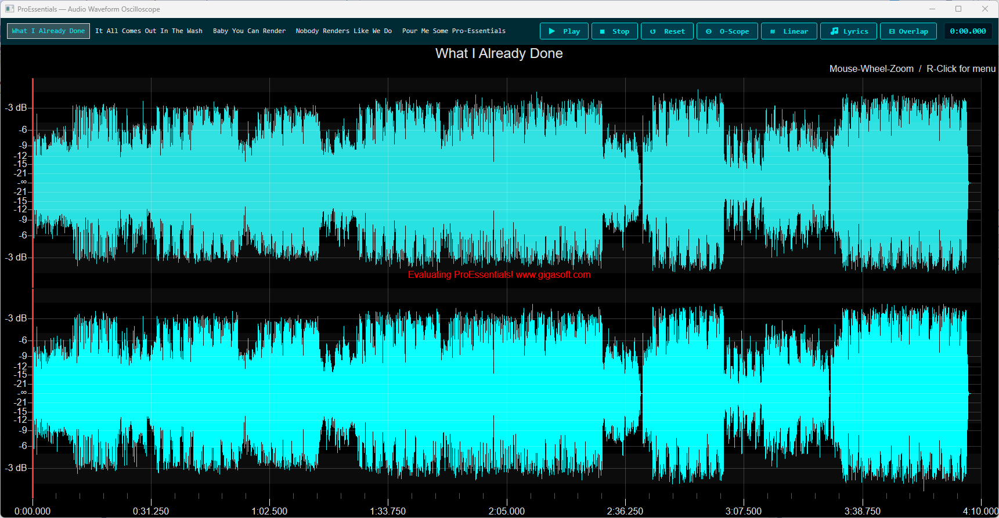

# ProEssentials WPF Audio Waveform Oscilloscope

A **ProEssentials v10 WPF .NET 8** dual-channel audio waveform visualizer
that doubles as a real oscilloscope. Zoom out to see the full song structure.
Zoom in with the mouse wheel to see individual waveform cycles — exactly like
a real oscilloscope.

Rendering millions of waveform samples in real time, at smooth interactive
frame rates, with zero data copying — this is the kind of workload ProEssentials
was built for.

The songs playing are **AI-generated on Suno.com** with custom lyrics about
ProEssentials charting performance. Because why not.

---



---

## The Songs

Five original songs generated on [Suno.com](https://suno.com) with custom
lyrics written specifically for this demo:

| File | Title | Style |
|------|-------|-------|
| `What-I-Already-Done-GigaSoft.wav` | What I Already Done | Charli XCX / modern pop |
| `ItAllComesOutInTheWash-GigaSoft.wav` | It All Comes Out In The Wash | Miranda Lambert sassy country |
| `BabyYouCanRender-Gigasoft.wav` | Baby You Can Render | Florida Georgia Line country |
| `NobodyRendersLikeWeDo-Gigasoft.wav` | Nobody Renders Like We Do | Epic rock anthem |
| `PourMeSomeProEssentials-GigaSoft.wav` | Pour Me Some Pro-Essentials | Morgan Wallen heartbreak |

---

## Controls

| Input | Action |
|-------|--------|
| Click song name | Switch to that song |
| ▶ Play / ❚❚ Pause | Start or pause playback |
| ■ Stop | Stop (saves position for resume) |
| ↺ Reset | Full reset — stop, rewind, clear zoom |
| ⊙ O-Scope | Zoom to oscilloscope view (37 ms window) |
| ≋ dBFS / Linear | Toggle Y axis between dBFS and linear labels |
| 🎵 Lyrics | Toggle synchronized lyric overlay |
| ⊡ Overlap | Overlay both channels on the same plot |
| Mouse wheel | Zoom in/out horizontally |
| Left-click drag | Pan when zoomed in |
| Left-click chart | Seek to that position |
| Right-click chart | Full options menu |

---

## What This Demonstrates

### Dual-Channel Oscilloscope

Two synchronized axes — Left channel on top, Right channel on bottom.
Zoom in with the mouse wheel and individual waveform cycles become visible,
exactly as on a real oscilloscope. The zoom window at the bottom always
shows the full song structure with a live position indicator.

### UseDataAtLocation — Zero Copy

```csharp
// Chart reads directly from app memory — no internal copy ever made
Pesgo1.PeData.X.UseDataAtLocation(tmpSongXData, SongSize);
Pesgo1.PeData.Y.UseDataAtLocation(tmpSongYData, SongSize * 2);
```

The entire waveform (both channels) lives in two `float[]` arrays allocated
once per song. The chart holds direct pointers into those arrays — no data
transfer, no copy, no buffer. For a 4-minute song at 16000 Hz this is roughly
7.5 million floats per channel. The Direct3D render engine works directly
against that memory on every frame, which is why the display stays responsive
even at full song scale with millions of visible points.

### Background Pre-Load

When a song starts playing, the **next** song is immediately read from disk
on a background `Task`. When the user (or auto-play) switches to it, the
arrays are swapped in by pointer assignment — no file I/O, near-instant
song switch.

```csharp
// Background thread writes, volatile bool signals completion to dispatcher
_preloadReady = true;   // dispatcher reads this in LoadSong()
```

### Auto-Play

When a song ends naturally the next song starts automatically. Toggleable
via the right-click menu → **🔁 Auto-Play Next Song**.

### Synchronized Lyrics

Every song has manually-timed lyric cues. The current line is displayed as a
graph annotation centered in the current viewport — it follows zoom and pan
so it is always readable. Toggle on/off with the **🎵 Lyrics** button or
right-click menu.

### Overlap Axes Mode

The **⊡ Overlap** button collapses both stacked axes into a single shared plot
area using `PeGrid.OverlapMultiAxes`. In overlap mode the Left channel switches
to amber and the Right channel stays cyan for clear visual separation.

```csharp
Pesgo1.PeGrid.OverlapMultiAxes[0] = 2;   // overlap both axes in one group
// Force D3D color cache to update — vertices unchanged, colors changed
Pesgo1.PeFunction.Force3dxNewColors = true;
```

### Right-Click Custom Menu (Example 127 Pattern)

All options are accessible via the ProEssentials built-in popup menu using
`PeUserInterface.Menu.CustomMenuText` — the same right-click surface that
hosts PE's own zoom/export items. Checkable toggles keep state in sync with
the toolbar buttons.

```csharp
Pesgo1.PeUserInterface.Menu.CustomMenuText[8]     = "🎵  Lyrics Overlay";
Pesgo1.PeUserInterface.Menu.CustomMenuLocation[8] = CustomMenuLocation.Bottom;
Pesgo1.PeUserInterface.Menu.CustomMenuState[8, 0] = CustomMenuState.Checked;
// PeCustomMenu event fires with e.MenuIndex / e.SubmenuIndex
```

### dBFS Y Axis Labels

The Y scale stays fixed at ±70 linear at all times. The **≋ dBFS** button
replaces the Y axis tick labels with standard DAW dBFS values by repositioning
`PeAnnotation.Line.YAxis` reference lines — no data changes, label-only swap.

```
dBFS → linear (at ±70 full scale):
  0 dBFS = ±70.0    -6 dBFS = ±35.1
 -3 dBFS = ±49.6    -9 dBFS = ±24.8   ...
```

### Smart Viewport Tracking

When zoomed in, the viewport follows the playhead automatically:
- **Range > 1 second** — viewport jumps forward when playhead exits right edge
- **Range < 1 second** — sub-second custom X axis labels appear for high-precision
  timestamp display; standard labels restored when zoomed back out

### Custom X Axis — Time Format

```csharp
Pesgo1.PeGrid.Option.CustomGridNumbersX = true;
// PeCustomGridNumber event:
double totalSec = e.NumberValue / SampleRate;
e.NumberString  = $"{mins}:{secs:00.000}";
```

Sample index values are formatted as `M:SS.mmm` timestamps on the X axis.

---

## Audio Playback — Technology Comparison

This demo uses `mciSendString`. Here is why, and what the alternatives offer:

### mciSendString — Win32 MCI (this demo)
```csharp
[DllImport("winmm.dll", CharSet = CharSet.Auto)]
static extern int mciSendString(string command,
    StringBuilder returnValue, int returnLength, IntPtr callback);

mciSendString($"open \"{path}\" type waveaudio alias song", null, 0, IntPtr.Zero);
mciSendString($"play song", null, 0, IntPtr.Zero);

var sb = new StringBuilder(128);
mciSendString("status song position", sb, 128, IntPtr.Zero); // ms position
```
✅ Zero dependencies — `winmm.dll` ships with every Windows since the 1990s  
✅ Simple string commands: open, play, seek, stop, status  
✅ Perfect for WAV playback with periodic position polling  
⚠️ WAV/MIDI only (no MP3 without codec)  
⚠️ ~80ms position query latency (compensated in timer)  
⚠️ Technically deprecated but fully supported on all current Windows  

### WMPLib.WindowsMediaPlayer — COM / Legacy
```csharp
// Requires adding COM reference: Windows Media Player
var wmp = new WMPLib.WindowsMediaPlayer();
wmp.URL = filePath;  // plays MP3, WMA, AAC
```
✅ Plays MP3, AAC, WMA, internet streams  
✅ Full WMP engine — playlists, metadata, visualizations  
❌ Requires COM interop + `WMPLib` reference  
❌ Ships the entire Windows Media Player engine — heavy  
❌ Not available on Windows N/KN without Media Feature Pack  
❌ Considered legacy; WMP itself is deprecated in Windows 11  

### WPF MediaPlayer / MediaElement — Built-in WPF
```csharp
var player = new System.Windows.Media.MediaPlayer();
player.Open(new Uri(filePath));
player.Play();
double ms = player.Position.TotalMilliseconds;
```
✅ No NuGet — built into .NET / WPF  
✅ MP3, WAV, WMA via Media Foundation pipeline  
⚠️ COM-based internally, position accuracy is less predictable  
⚠️ Less control over seek/buffer behavior  

### NAudio — NuGet (recommended for real audio apps)
```csharp
// NuGet: NAudio  (by Mark Heath)
var reader = new AudioFileReader(filePath);
var output = new WaveOutEvent();
output.Init(reader);
output.Play();
double ms = reader.CurrentTime.TotalMilliseconds; // accurate
```
✅ Full-featured: playback, recording, DSP, FFT, WASAPI, ASIO  
✅ Accurate position with waveform callbacks  
✅ Ideal if doing FFT/spectrum analysis in .NET alongside the chart  
✅ Active development, well documented  
❌ Adds a NuGet dependency  

### Media Foundation (IMFMediaEngine) — Modern Win32
✅ Best format support and lowest latency on Windows  
✅ GPU-accelerated video path  
❌ Significant P/Invoke boilerplate in C#  
❌ Overkill for simple WAV playback  

**Bottom line:** `mciSendString` was chosen because the goal was zero external
dependencies. The WAV files are already decoded into `float[]` for the chart —
audio playback only needs play/pause/seek/position, which MCI handles perfectly.
For a production audio application, **NAudio** is the right choice.

---

## WAV File Requirements

All songs must be:
- **Format**: WAV, Legacy header
- **Encoding**: Signed 16-bit PCM
- **Channels**: Stereo (2 channels)
- **Sample Rate**: 16000 Hz

**Audacity export steps:**
1. Set Project Rate (bottom of screen) to **16000 Hz**
2. File → Export → Export as WAV
3. Encoding: **Signed 16-bit PCM**
4. Edit → Metadata Editor → Clear all fields (removes extra chunks)
5. Header: **Legacy**

---

## Generating Your Own Songs

1. Go to [suno.com](https://suno.com)
2. Use **Custom Mode** with `[Verse]`, `[Chorus]`, `[Bridge]` tags
3. Download as MP3 or WAV
4. Convert in Audacity to 16-bit stereo 16000 Hz Legacy WAV (steps above)
5. Drop the WAV into the project root folder
6. Add the filename and title to `SongFiles[]` and `SongTitles[]` in `MainWindow.xaml.cs`
7. Add a `LyricsSongName.cs` lyrics class for timed lyric cues (optional)

---

## Prerequisites

- Visual Studio 2022
- .NET 8 SDK

---

## How to Run

```
1. Clone this repository
2. Copy your 5 WAV files into the project root folder
3. Open AudioWaveform.sln in Visual Studio 2022
4. Build → Rebuild Solution  (NuGet restore is automatic)
5. Press F5
6. Select a song and press Play
7. Mouse wheel to zoom — oscilloscope view appears below 1 second
8. Right-click the chart for the full options menu
```

---

## NuGet Package

References
[`ProEssentials.Chart.Net80.x64.Wpf`](https://www.nuget.org/packages/ProEssentials.Chart.Net80.x64.Wpf).
Restore is automatic on build.

---

## Evaluating ProEssentials?

Thank you for taking the time to look at this project.

This repo is intentionally minimal — the core chart interaction is only a few
hundred lines of code, and most of that is audio plumbing and lyrics timing.
The waveform display itself, with millions of points, smooth zoom, live
playhead, dual axes, and Direct3D rendering, required almost no
chart-specific code to achieve.

If you are comparing charting libraries, this makes a reasonable benchmark.
Take the same scenario — dual-channel waveform, millions of points, interactive
zoom, real-time annotation updates at 25ms — and try to reproduce it with the
library you are currently evaluating. Rendering throughput, memory architecture,
and API surface area tend to reveal themselves quickly at this data scale.

[Full evaluation download](https://gigasoft.com/net-chart-component-wpf-winforms-download) —
includes 150+ working examples across WPF, WinForms, and .NET 8.

---

## Related

- [WPF Quickstart](https://github.com/GigasoftInc/wpf-chart-quickstart-proessentials)
- [GigaPrime2D WPF — 100 Million Points](https://github.com/GigasoftInc/wpf-chart-fast-100m-points-proessentials)
- [All Examples — GigasoftInc on GitHub](https://github.com/GigasoftInc)
- [Full Evaluation Download](https://gigasoft.com/net-chart-component-wpf-winforms-download)
- [gigasoft.com](https://gigasoft.com)

---

## License

Example code is MIT licensed. ProEssentials requires a commercial license for
continued use beyond evaluation. Songs are original works generated on
Suno.com — see [Suno's terms](https://suno.com/legal) for usage rights.

---

## Built with AI Assistance

This repo was built using **Claude 4.6** with Gigasoft's ProEssentials AI
knowledge resources — a purpose-built query tool (`pe_query.py`) that gives
an AI direct access to the full API: 1,100+ properties, enums, events,
functions, and 116 working code examples extracted from the DLL itself.

Rather than guessing at property names, Claude queried the tool at each step
to retrieve exact paths, validate them, and pull relevant examples. Several
examples were particularly useful in building this project:

- **Example 103/104** — overlapped multi-axes pattern (`OverlapMultiAxes`)
- **Example 127** — custom right-click menu (`CustomMenuText` / `PeCustomMenu` event)
- **Example 128+** — multi-axis setup with `MultiAxesSubsets` and `WorkingAxis`

The result is a demo where the chart code is correct on the first run —
no trial-and-error on property names, no guessed enum values. If you are
building a ProEssentials integration and using AI assistance, the
`pe_query.py` resources are available in the
[Gigasoft GitHub organization](https://github.com/GigasoftInc).


